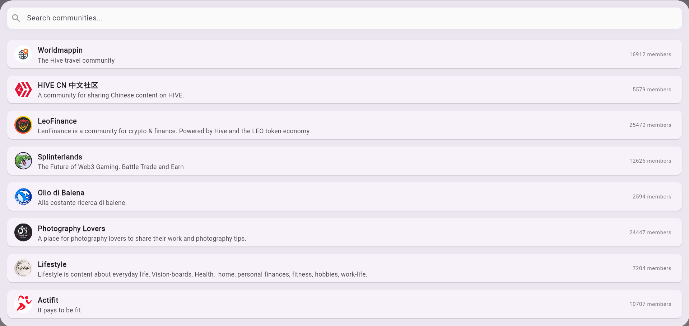

## 📃 CommunitiesList Widget

### Purpose

Displays a list of Hive communities with search and infinite scrolling support. Useful for letting users select or browse communities interactively.

### Features

* Search bar with live filtering
* Infinite scroll for pagination
* Error handling and retry
* Tap to select a community
* Shows avatar, title, about text, and member count

### Key Input Parameters

| Parameter           | Type                                   | Description                                                   |
| ------------------- | -------------------------------------- | ------------------------------------------------------------- |
| `onSelectCommunity` | `Future<void> Function(CommunityItem)` | Callback when a community is selected.                        |
| `hfk`               | `HiveFlutterKitPlatform`               | Hive blockchain service instance for fetching community data. |

### Usage Example

```dart
CommunitiesList(
  onSelectCommunity: (community) async {
    // Handle navigation or action with selected community
  },
  hfk: hiveFlutterKit,
)
```

### Screenshot



---

## See Also

* `AccountPostsScreen`
* `BlogScreen`
* `CommentsScreen`
* `CommunityScreen`
* `RepliesScreen`
* `UserProfilePicture`
* `TrendingFeedScreen`
* `Discussion` Model
* `CommunityItem` Model
