The Dhive widget is a Flutter component designed to interact with the Hive blockchain. It provides various UI elements and functionalities for displaying Hive content, user profiles, and facilitating user interactions.

## Overall Architecture

The widget is structured into several key components:

- **Screens:** These are top-level widgets that represent different views within the application, such as `TrendingFeedScreen`, `BlogScreen`, `CommentsScreen`, etc.
- **Common Views:** Reusable UI components like `ViewList` and `ViewComments` are used across different screens to maintain consistency.
- **User Profile:** Components like `UserProfilePicture` are dedicated to displaying user-specific information.
- **Common Enums:** The `ViewMode` enum (`lib/ux/dhive/common/enum.dart`) defines different layout options for displaying content.

This document provides an overview and usage examples for the Dhive UI widgets available in the `hive_flutter_kit`. These widgets help you quickly build user interfaces for interacting with the Hive blockchain.

### Components

## AccountPostsScreen

The `AccountPostsScreen` widget displays a scrollable list of blog posts for a specified Hive account. It handles fetching posts, displaying them, and supports infinite scrolling to load more posts as the user scrolls. It also provides various callbacks for user interactions with the posts.

### Parameters:

- `key` (Key?): Optional. An optional key for the widget.
- `dhive` (HiveFlutterKitPlatform): **Required**. The instance of `HiveFlutterKitPlatform` used to interact with the Hive blockchain.
- `account` (String): **Required**. The username of the Hive account whose posts are to be fetched and displayed.
- `onTap` (Function?): Optional. Callback triggered when a post item is tapped. It typically receives the `Discussion` object of the tapped post.
- `onAuthorTap` (Function?): Optional. Callback triggered when the author's avatar or name is tapped. It might receive the author's username as a parameter.
- `onCategoryTap` (Function?): Optional. Callback triggered when the post's category is tapped. It might receive the category string as a parameter.
- `onUpvoteTap` (Function?): Optional. Callback triggered when the upvote icon is tapped. It might receive the `Discussion` object or its identifier.
- `onCommentTap` (Function?): Optional. Callback triggered when the comment icon is tapped. It might receive the `Discussion` object or its identifier.
- `onReblogTap` (Function?): Optional. Callback triggered when the reblog icon is tapped. It might receive the `Discussion` object or its identifier.

### Usage Example:

```dart
import 'package:flutter/material.dart';
import 'package:hive_flutter_kit/hive_flutter_kit.dart';
// Assuming HiveFlutterKit.platform has been initialized
// import 'package:hive_flutter_kit/core/hive_flutter_kit_platform_interface.dart'; // Or your specific platform import

class MyFeedScreen extends StatelessWidget {
  final HiveFlutterKitPlatform dhive; // Or your specific initialized dhive instance
  final String accountName = "hivebuzz"; // Example account

  MyFeedScreen({super.key, required this.dhive});

  @override
  Widget build(BuildContext context) {
    return Scaffold(
      appBar: AppBar(
        title: Text("Posts by @$accountName"),
      ),
      body: AccountPostsScreen(
        dhive: dhive, // Pass your initialized HiveFlutterKitPlatform instance
        account: accountName,
        onTap: (Discussion post) {
          // Navigate to post details screen or show more info
          print("Tapped on post: ${post.permlink}");
        },
        onAuthorTap: (String author) {
          print("Tapped on author: $author");
          // Navigate to author's profile
        },
        onUpvoteTap: (Discussion post) {
          print("Upvoted post: ${post.permlink}");
          // Handle upvote action
        },
        onnCommentTap: (Discussion post) {
          print("Commented on post: ${post.permlink}");
          // Handle comment action
          },
        onReblogTap: (Discussion post) {
            print("Reblogged post: ${post.permlink}");
            // Handle reblog action
        },
        // You can implement other callbacks as needed
      ),
    );
  }
}

// Example of how you might initialize and use MyFeedScreen:
// main() async {
//   WidgetsFlutterBinding.ensureInitialized();
//   // Initialize HiveFlutterKitPlatform according to its documentation
//   // For example:
//   // final dhive = await HiveFlutterKit.platform.initialize(...);
//   // runApp(MaterialApp(home: MyFeedScreen(dhive: dhive)));
// }
```

- **ScreenShots**
  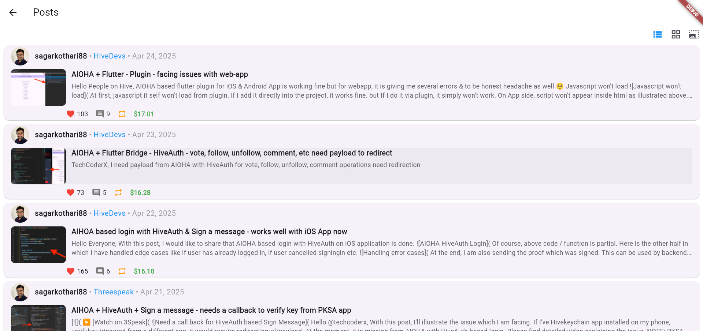
  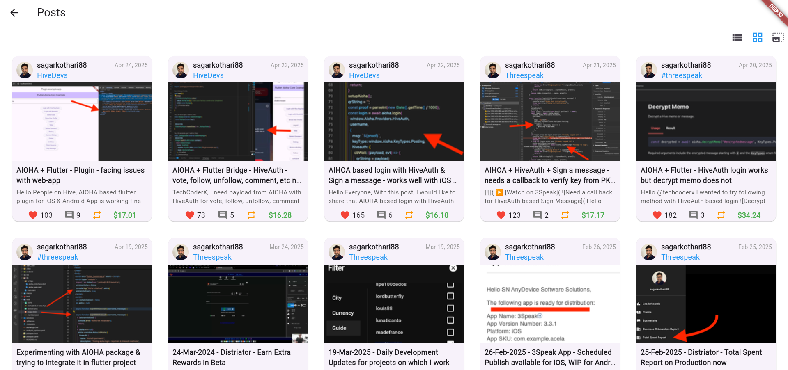
  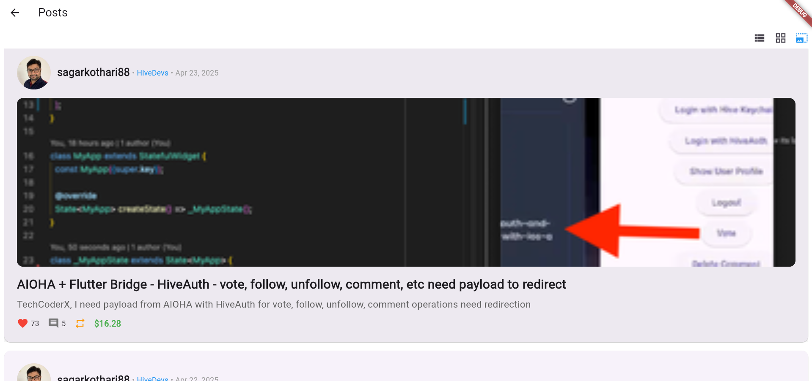

## BlogScreen

The `BlogScreen` widget displays a scrollable list of blog entries (which includes original posts and reblogs) for a specified Hive account. It's designed to show content as it would typically appear on an account's blog feed. The widget handles fetching entries, displaying them, and supports infinite scrolling for loading more content. It also offers various callbacks for user interactions.

### Parameters:

- `key` (Key?): Optional. An optional key for the widget.
- `dhive` (HiveFlutterKitPlatform): **Required**. The instance of `HiveFlutterKitPlatform` used to interact with the Hive blockchain.
- `account` (String): **Required**. The username of the Hive account whose blog entries are to be fetched and displayed.
- `onTap` (Function?): Optional. Callback triggered when a blog entry is tapped. It typically receives the `Discussion` object of the tapped entry.
- `onAuthorTap` (Function?): Optional. Callback triggered when the author's avatar or name is tapped. It might receive the author's username as a parameter.
- `onCategoryTap` (Function?): Optional. Callback triggered when the blog entry's category is tapped. It might receive the category string as a parameter.
- `onUpvoteTap` (Function?): Optional. Callback triggered when the upvote icon is tapped. It might receive the `Discussion` object or its identifier.
- `onCommentTap` (Function?): Optional. Callback triggered when the comment icon is tapped. It might receive the `Discussion` object or its identifier.
- `onReblogTap` (Function?): Optional. Callback triggered when the reblog icon is tapped. It might receive the `Discussion` object or its identifier.

### Usage Example:

```dart
import 'package:flutter/material.dart';
import 'package:hive_flutter_kit/hive_flutter_kit.dart';
// Assuming HiveFlutterKit.platform has been initialized
// import 'package:hive_flutter_kit/core/hive_flutter_kit_platform_interface.dart'; // Or your specific platform import

class MyBlogDisplayScreen extends StatelessWidget {
  final HiveFlutterKitPlatform dhive; // Or your specific initialized dhive instance
  final String accountName = "ecency"; // Example account

  MyBlogDisplayScreen({super.key, required this.dhive});

  @override
  Widget build(BuildContext context) {
    return Scaffold(
      appBar: AppBar(
        title: Text("Blog of @$accountName"),
      ),
      body: BlogScreen(
        dhive: dhive, // Pass your initialized HiveFlutterKitPlatform instance
        account: accountName,
        onTap: (Discussion blogEntry) {
          // Navigate to blog entry details screen or show more info
          print("Tapped on blog entry: ${blogEntry.permlink}");
          if (blogEntry.rebloggedBy != null && blogEntry.rebloggedBy!.isNotEmpty) {
            print("This was reblogged by: ${blogEntry.rebloggedBy!.join(', ')}");
          }
        },
        onAuthorTap: (String author) {
          print("Tapped on author: $author");
          // Navigate to author's profile
        },
        // Implement other callbacks as needed
      ),
    );
  }
}

// Example of how you might initialize and use MyBlogDisplayScreen:
// main() async {
//   WidgetsFlutterBinding.ensureInitialized();
//   // Initialize HiveFlutterKitPlatform according to its documentation
//   // For example:
//   // final dhive = await HiveFlutterKit.platform.initialize(...);
//   // runApp(MaterialApp(home: MyBlogDisplayScreen(dhive: dhive)));
// }
```

- **ScreenShots**
  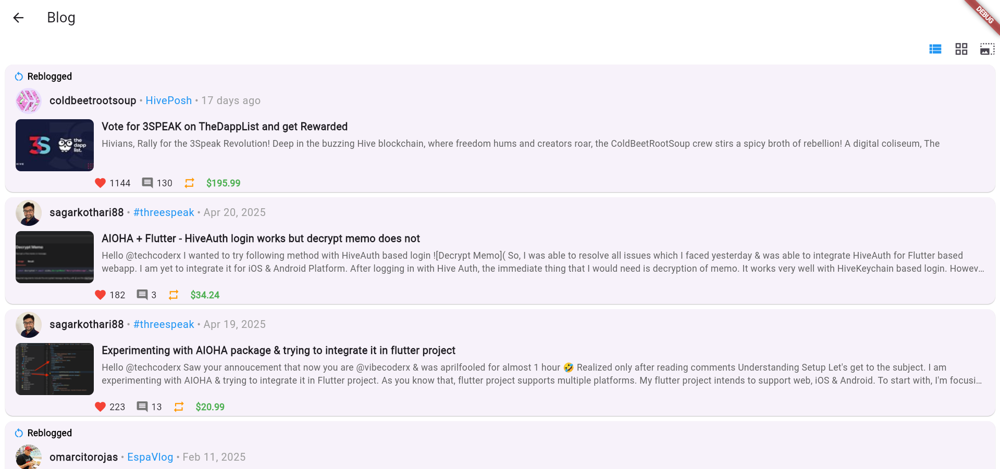
  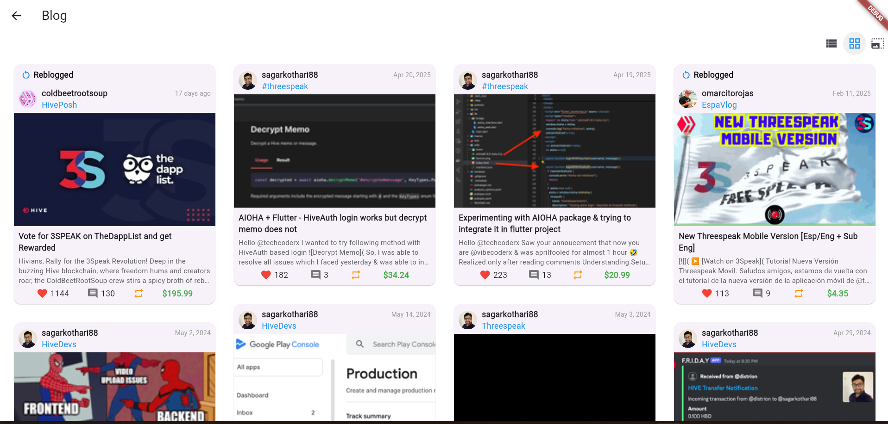
  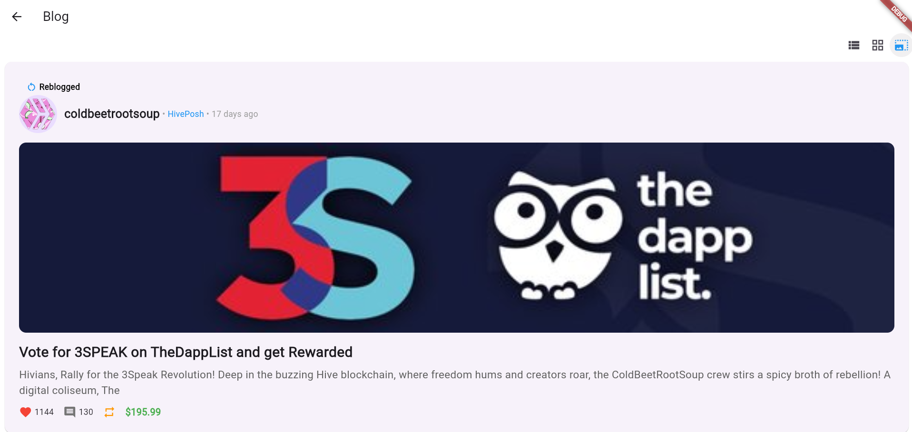

## CommentsScreen

The `CommentsScreen` widget is designed to display a scrollable list of comments authored by a specific Hive account. It manages fetching these comments from the blockchain, presenting them to the user, and implementing an infinite scroll mechanism to load older comments as the user scrolls. Like other similar widgets in the kit, it supports various callbacks for user interactions.

### Parameters:

- `key` (Key?): Optional. An optional key for the widget.
- `dhive` (HiveFlutterKitPlatform): **Required**. The instance of `HiveFlutterKitPlatform` used for blockchain interactions, specifically to fetch comments.
- `account` (String): **Required**. The username of the Hive account whose authored comments are to be displayed.
- `onTap` (Function?): Optional. Callback triggered when a comment item itself is tapped. It usually passes the `Discussion` object of the comment.
- `onAuthorTap` (Function?): Optional. Callback triggered when the author's avatar or name on a comment is tapped.
- `onCategoryTap` (Function?): Optional. Callback for when the category is tapped. For comments, this might refer to the category of the parent post.
- `onUpvoteTap` (Function?): Optional. Callback triggered when the upvote icon on a comment is tapped.
- `onCommentTap` (Function?): Optional. Callback triggered when the reply/comment icon on a comment is tapped, likely to reply to that comment.
- `onReblogTap` (Function?): Optional. Callback for a reblog action. Note that reblogging individual comments is not a standard Hive feature; this callback's utility might be specific to the app's custom functionality.

### Usage Example:

```dart
import 'package:flutter/material.dart';
import 'package:hive_flutter_kit/hive_flutter_kit.dart';
// Assuming HiveFlutterKit.platform has been initialized
// import 'package:hive_flutter_kit/core/hive_flutter_kit_platform_interface.dart'; // Or your specific platform import

class MyCommentsViewScreen extends StatelessWidget {
  final HiveFlutterKitPlatform dhive; // Or your specific initialized dhive instance
  final String accountName = "gtg"; // Example account known for many comments

  MyCommentsViewScreen({super.key, required this.dhive});

  @override
  Widget build(BuildContext context) {
    return Scaffold(
      appBar: AppBar(
        title: Text("Comments by @$accountName"),
      ),
      body: CommentsScreen(
        dhive: dhive, // Pass your initialized HiveFlutterKitPlatform instance
        account: accountName,
        onTap: (Discussion comment) {
          // Display the comment details or navigate to its parent post
          print("Tapped on comment: ${comment.permlink}");
          print("Parent post: @${comment.parentAuthor}/${comment.parentPermlink}");
        },
        onAuthorTap: (String author) {
          print("Tapped on author: $author");
          // Navigate to author's profile
        },
        onUpvoteTap: (Discussion comment) {
          print("Upvoted comment: ${comment.permlink}");
          // Handle upvote action for the comment
        },
        // Implement other callbacks as needed
      ),
    );
  }
}

// Example of how you might initialize and use MyCommentsViewScreen:
// main() async {
//   WidgetsFlutterBinding.ensureInitialized();
//   // Initialize HiveFlutterKitPlatform according to its documentation
//   // For example:
//   // final dhive = await HiveFlutterKit.platform.initialize(...);
//   // runApp(MaterialApp(home: MyCommentsViewScreen(dhive: dhive)));
// }
```

- **ScreenShots**
  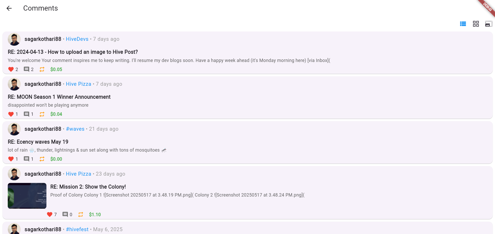
  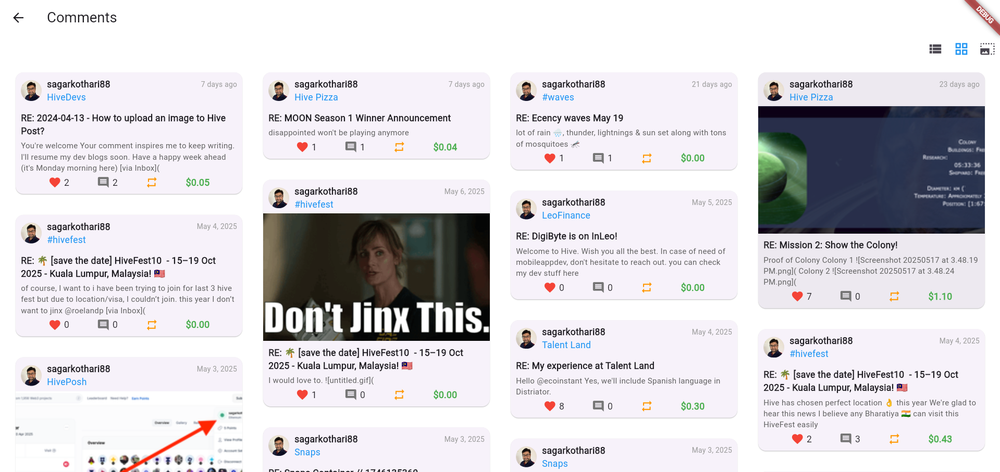
  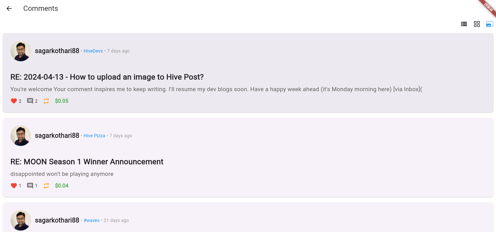

## CommunityScreen

The `CommunityScreen` widget provides a way to display a feed of posts ("discussions") based on a specific tag, often used to show content from a particular Hive community or posts related to a certain topic. It allows sorting these posts by various criteria (e.g., trending, created, hot). The widget includes features like infinite scrolling for loading more posts and provides callbacks for common user interactions.

### Parameters:

- `key` (Key?): Optional. An optional key for the widget.
- `dhive` (HiveFlutterKitPlatform): **Required**. The instance of `HiveFlutterKitPlatform` used to fetch the discussions from the Hive blockchain.
- `tag` (String): **Required**. The primary tag to filter the posts by. For communities, this is the community ID (e.g., `hive-10053`). It can also be any other content tag.
- `sortBy` (String): **Required**. The sorting criteria for the posts. Common values include `trending`, `hot`, `created`, `payout`, `payout_comments`. The exact available options may depend on the underlying Hive API method used by `dhive.getDiscussions`.
- `onTap` (Function?): Optional. Callback triggered when a post item is tapped. It typically receives the `Discussion` object.
- `onAuthorTap` (Function?): Optional. Callback triggered when an author's avatar or name is tapped.
- `onCategoryTap` (Function?): Optional. Callback triggered when a post's category tag is tapped.
- `onUpvoteTap` (Function?): Optional. Callback for when the upvote icon is tapped.
- `onCommentTap` (Function?): Optional. Callback for when the comment icon is tapped.
- `onReblogTap` (Function?): Optional. Callback for when the reblog icon is tapped.

### Usage Example:

```dart
import 'package:flutter/material.dart';
import 'package:hive_flutter_kit/hive_flutter_kit.dart';
// Assuming HiveFlutterKit.platform has been initialized
// import 'package:hive_flutter_kit/core/hive_flutter_kit_platform_interface.dart'; // Or your specific platform import

class MyCommunityFeedScreen extends StatelessWidget {
  final HiveFlutterKitPlatform dhive; // Or your specific initialized dhive instance
  final String communityTag = "hive-125125"; // Example: HiveDevs community
  final String sortOrder = "trending"; // Or "created", "hot", etc.

  MyCommunityFeedScreen({super.key, required this.dhive});

  @override
  Widget build(BuildContext context) {
    return Scaffold(
      appBar: AppBar(
        title: Text("Trending in $communityTag"),
      ),
      body: CommunityScreen(
        dhive: dhive,
        tag: communityTag,
        sortBy: sortOrder,
        onTap: (Discussion post) {
          print("Tapped on post: @${post.author}/${post.permlink}");
          // Navigate to post details
        },
        onAuthorTap: (String author) {
          print("Tapped on author: $author");
          // Navigate to author's profile
        },
        // Implement other callbacks as needed
      ),
    );
  }
}

// Example of how you might initialize and use MyCommunityFeedScreen:
// main() async {
//   WidgetsFlutterBinding.ensureInitialized();
//   // Initialize HiveFlutterKitPlatform according to its documentation
//   // For example:
//   // final dhive = await HiveFlutterKit.platform.initialize(...);
//   // runApp(MaterialApp(home: MyCommunityFeedScreen(dhive: dhive)));
// }
```

- **ScreenShots**
  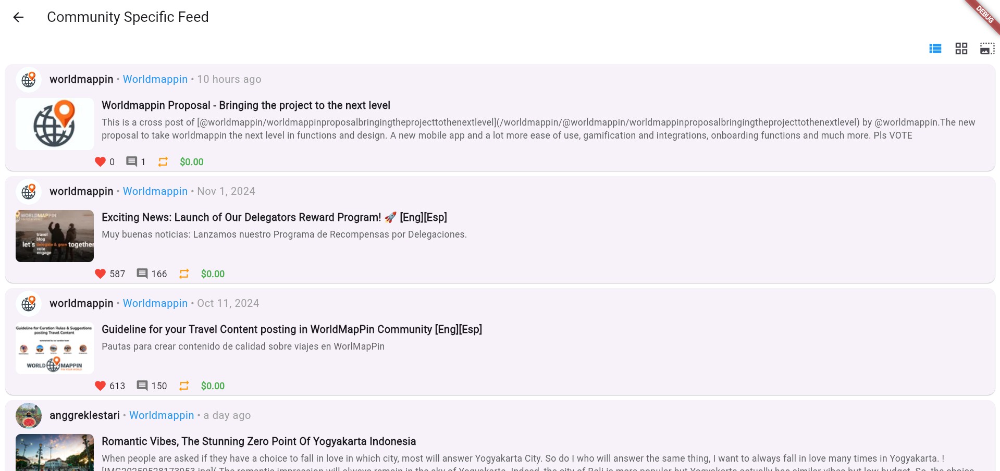
  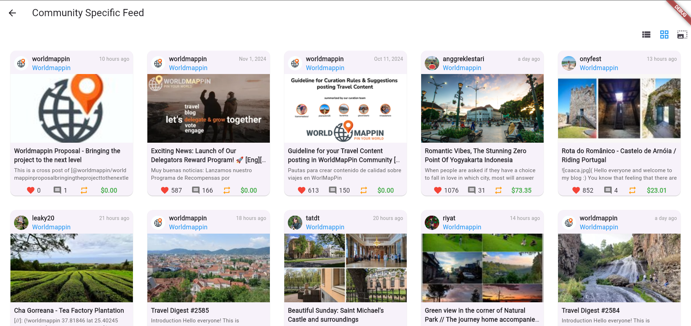
  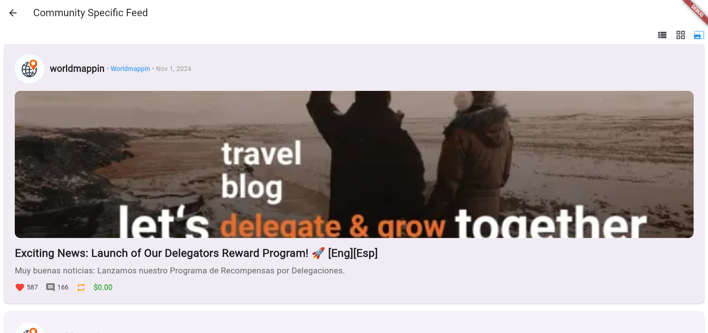

## RepliesScreen

The `RepliesScreen` widget is used to display a scrollable list of replies that a specific Hive account has received on their posts or comments. It fetches discussions using the "replies" filter specific to that account. The widget handles pagination (infinite scrolling) and provides standard interaction callbacks.

### Parameters:

- `key` (Key?): Optional. An optional key for the widget.
- `dhive` (HiveFlutterKitPlatform): **Required**. The instance of `HiveFlutterKitPlatform` used for fetching the replies from the Hive blockchain.
- `account` (String): **Required**. The username of the Hive account whose replies are to be displayed.
- `onTap` (Function?): Optional. Callback triggered when a reply item is tapped. It typically passes the `Discussion` object of the reply.
- `onAuthorTap` (Function?): Optional. Callback triggered when the author's avatar or name on a reply is tapped.
- `onCategoryTap` (Function?): Optional. Callback for when the category is tapped. For replies, this usually refers to the category of the top-level post to which the reply chain belongs.
- `onUpvoteTap` (Function?): Optional. Callback triggered when the upvote icon on a reply is tapped.
- `onCommentTap` (Function?): Optional. Callback triggered when the reply/comment icon on a reply is tapped, enabling users to reply to that specific reply.
- `onReblogTap` (Function?): Optional. Callback for a reblog action. Reblogging individual replies is not a standard Hive feature, so this callback's use may be context-dependent.

### Usage Example:

```dart
import 'package:flutter/material.dart';
import 'package:hive_flutter_kit/hive_flutter_kit.dart';
// Assuming HiveFlutterKit.platform has been initialized
// import 'package:hive_flutter_kit/core/hive_flutter_kit_platform_interface.dart'; // Or your specific platform import

class MyAccountRepliesScreen extends StatelessWidget {
  final HiveFlutterKitPlatform dhive; // Or your specific initialized dhive instance
  final String accountName = "peakd"; // Example account to see replies to their content

  MyAccountRepliesScreen({super.key, required this.dhive});

  @override
  Widget build(BuildContext context) {
    return Scaffold(
      appBar: AppBar(
        title: Text("Replies to @$accountName"),
      ),
      body: RepliesScreen(
        dhive: dhive, // Pass your initialized HiveFlutterKitPlatform instance
        account: accountName,
        onTap: (Discussion reply) {
          // Display the reply details or navigate to its context
          print("Tapped on reply from @${reply.author}: ${reply.permlink}");
          print("In response to: @${reply.parentAuthor}/${reply.parentPermlink}");
        },
        onAuthorTap: (String author) {
          print("Tapped on author of reply: $author");
          // Navigate to author's profile
        },
        // Implement other callbacks as needed
      ),
    );
  }
}

// Example of how you might initialize and use MyAccountRepliesScreen:
// main() async {
//   WidgetsFlutterBinding.ensureInitialized();
//   // Initialize HiveFlutterKitPlatform according to its documentation
//   // For example:
//   // final dhive = await HiveFlutterKit.platform.initialize(...);
//   // runApp(MaterialApp(home: MyAccountRepliesScreen(dhive: dhive)));
// }
```

- **ScreenShots**
  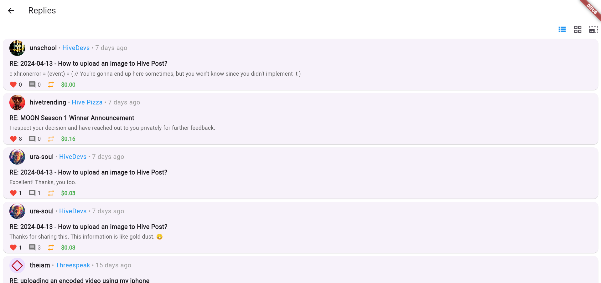
  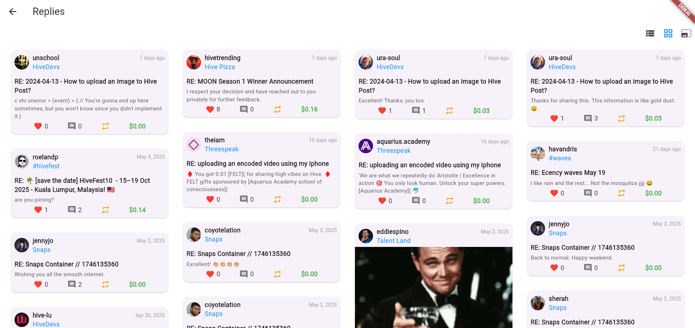
  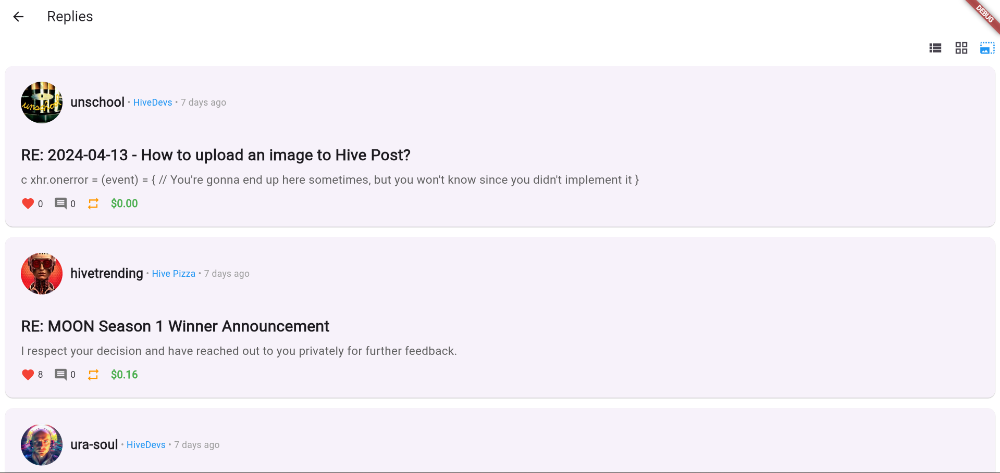

## TrendingFeedScreen

- **Purpose:** Displays a feed of trending posts from the Hive blockchain.
- **Functionality:**
  - Fetches and displays a list of discussions (posts) sorted by "trending".
  - Implements infinite scrolling to load more posts as the user scrolls.
  - Allows users to interact with posts through tapping, upvoting, downvoting, commenting, and reblogging.
- **Key Input Parameters:**
  - `dhive`: An instance of `HiveFlutterKitPlatform` for interacting with the Hive blockchain.
  - `onTap`: Callback function when a post is tapped.
  - `onAuthorTap`: Callback function when an author's name is tapped.
  - `onCategoryTap`: Callback function when a category is tapped.
  - `onUpvoteTap`: Callback function for upvoting.
  - `onCommentTap`: Callback function for commenting.
  - `onReblogTap`: Callback function for reblogging.
- **Usage Example:**
  ```dart
  TrendingFeedScreen(
    dhive: hiveFlutterKit, // Your HiveFlutterKitPlatform instance
    onTap: (discussion) {
      // Handle post tap
    },
    // ... other callbacks
  )
  ```
  **ScreenShots**
  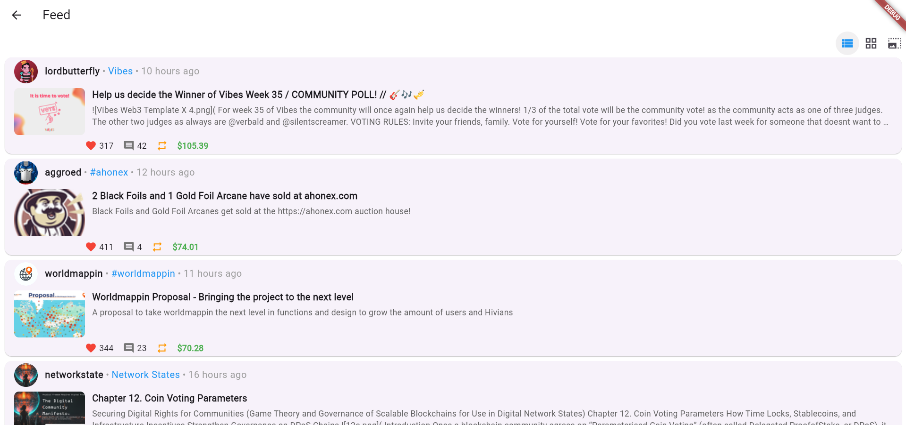
  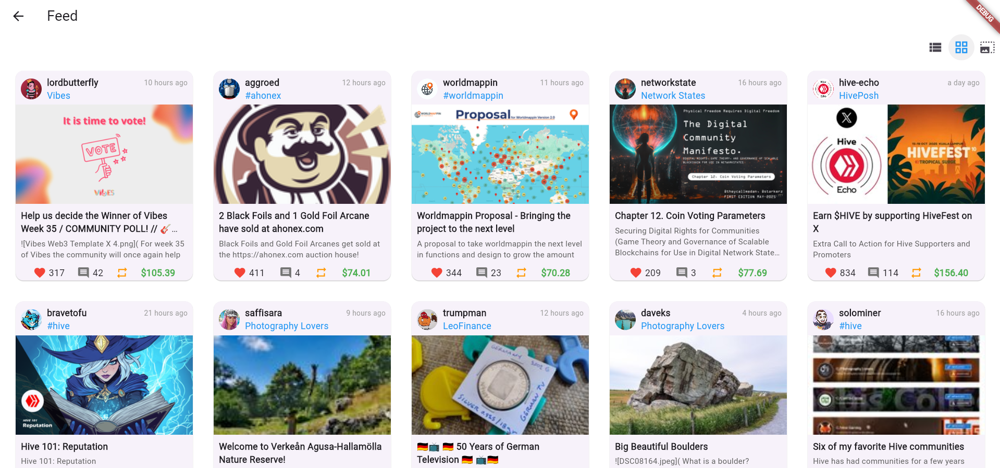
  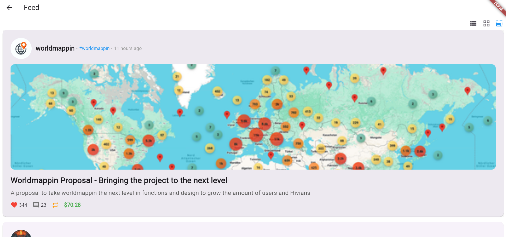

## UserProfilePicture

- **Purpose:** Displays a user's profile picture, username, and key statistics.
- **Functionality:**
  - Fetches and displays the user's avatar.
  - Shows the username.
  - Displays voting power (upvote and downvote) and resource credits percentage.
  - Optionally shows more details on tap.
- **Key Input Parameters:**
  - `username`: The Hive username of the user.
  - `dhive`: An instance of `HiveFlutterKitPlatform`.
  - `showDetails`: Boolean to initially show/hide detailed stats (default: `false`).
  - `showDetailsDisabled`: Boolean to disable the tap-to-show-details functionality (default: `false`).
  - `upvoteColor`: Color for the upvote power bar (default: `Colors.green`).
  - `downvoteColor`: Color for the downvote power bar (default: `Colors.red`).
  - `resourceCreditsColor`: Color for the resource credits bar (default: `Colors.blue`).
  - `showBars`: Boolean to show/hide the power bars (default: `true`).
  - `onTap`: Optional callback function when the profile picture area is tapped. If provided, it overrides the default behavior of toggling details.
- **Usage Example:**
  ```dart
  UserProfilePicture(
    username: "someuser",
    dhive: hiveFlutterKit, // Your HiveFlutterKitPlatform instance
    showDetails: true,
  )
  ```
  **ScreenShots**
  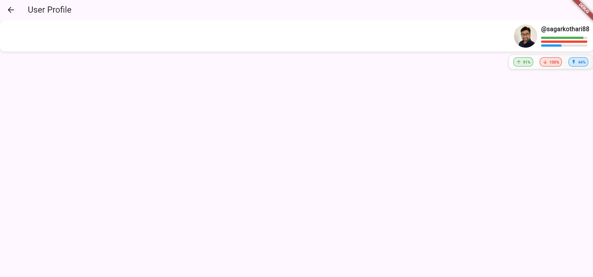

**Note:** The specific parameters and detailed functionality for these screens would require individual inspection of their source code. The documentation above provides a general overview.

## Enums

### ViewMode

- **Path:** `lib/ux/dhive/common/enum.dart`
- **Purpose:** Defines different layout options for displaying lists of content.
- **Values:**
  - `list`: Displays items in a traditional list format.
  - `grid`: Displays items in a grid layout.
  - `large`: Displays items in a larger, more detailed format (e.g., cards with more content visible).

**Note:** The exact visual representation of each mode depends on how it's implemented in the respective list view components (e.g., `ViewList`).
