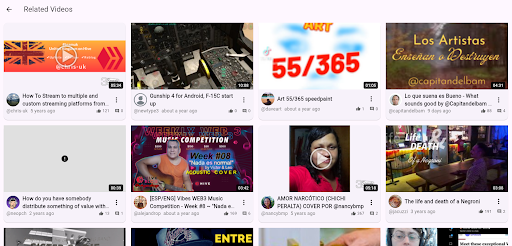
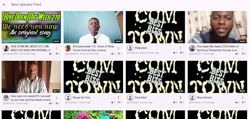
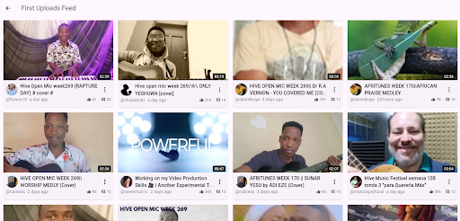
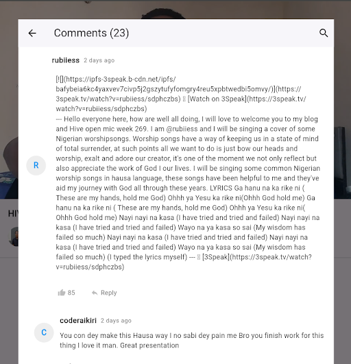
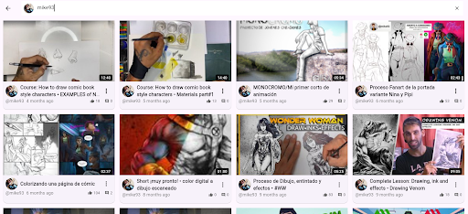
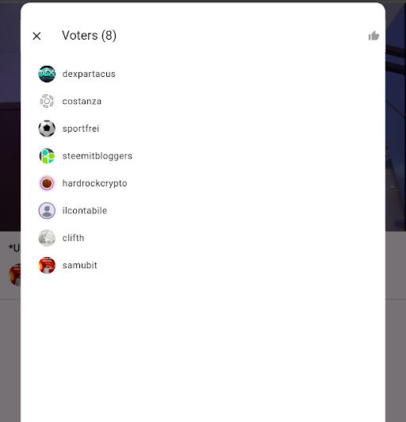

# Three Speak

Three Speak is a video hosting and sharing platform built on the Hive blockchain. This package provides Flutter widgets to easily integrate Three Speak functionality into your applications.

## Overview

The main components of this package are:

- **Video Feeds**: Display various video feeds like trending, new uploads, first uploads, and related videos.
- **Video Player**: Play videos and view their details.
- **Video Search**: Search for videos on the Three Speak platform.

## Widgets

### `ThreeSpeakVideoFeed`

This widget displays different types of video feeds. You can customize the feed type and handle taps on video items.

**Feed Types:**

- `trending`: Shows trending videos.
- `new`: Shows newly uploaded videos.
- `first_upload`: Shows first uploads from creators.
- `related`: Shows videos related to a specific video (requires `videoId` parameter).

#### Trending Feed


#### Related Feed


#### New Uploads Feed


#### First Uploads Feed


### Comments


### Search screen


### Upvotes


### User Feed


### Video Player Screen


**Usage Example (from `example/lib/home.dart`):**

```dart
// Display trending videos
ThreeSpeakVideoFeed(
  feedType: ThreeSpeakVideoFeedType.trending,
  onVideoTap: (video) {
    // Handle video tap, e.g., navigate to VideoPlayerScreen
    Navigator.push(
      context,
      MaterialPageRoute(
        builder: (context) => VideoPlayerScreen(video: video),
      ),
    );
  },
)

// Display related videos
ThreeSpeakVideoFeed(
  feedType: ThreeSpeakVideoFeedType.related,
  videoId: 'some_video_id',
  onVideoTap: (video) {
    // Handle video tap
  },
)
```

### `VideoPlayerScreen`

This screen plays a selected video and displays its details.

**Usage Example (from `example/lib/home.dart`):**

```dart
// Navigate to VideoPlayerScreen when a video is tapped
Navigator.push(
  context,
  MaterialPageRoute(
    builder: (context) => VideoPlayerScreen(video: video), // 'video' is the tapped Video object
  ),
);
```


## Core Components

The `lib/core/three_speak_core/` directory contains important core components and providers that power the widgets. These are generally used internally by the widgets, but you might interact with them for more advanced customization.

- **`ThreeSpeakService`**: Handles API requests to the Three Speak platform.
- **`VideoProvider`**: Manages video state and data fetching.

```dart
// Example: Accessing ThreeSpeakService (though typically not needed directly)
final threeSpeakService = Provider.of<ThreeSpeakService>(context, listen: false);
// Use the service to make API calls
```

Make sure to have the necessary providers set up in your application, usually at the root, to ensure the widgets can access the required services.
For example, in `main.dart` or your app's entry point:

```dart
MultiProvider(
  providers: [
    ChangeNotifierProvider(create: (_) => VideoProvider(ThreeSpeakService())),
    // Other providers
  ],
  child: MyApp(),
)
```
