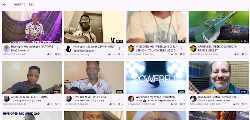

# Trending Feed Component



The `ThreeSpeakFeedList` with `feedType: ThreeSpeakFeedType.trending` displays a grid/list of currently trending videos from the ThreeSpeak platform, sorted by popularity and engagement metrics.

## Features

- 🚀 **Smart Layout** - Automatically switches between grid and list view based on screen width
- ♻️ **Pull-to-Refresh** - Built-in refresh functionality
- 🖼️ **Optimized Thumbnails** - Efficient image loading with placeholder
- 📊 **Engagement Metrics** - Displays view counts, upvotes, and timestamps
- 🔍 **Visibility Detection** - Only renders visible items for performance

## Basic Usage

```dart
ThreeSpeakFeedList(
  feedType: ThreeSpeakFeedType.trending,
  onTapVideoItem: (item) {
    Navigator.push(
      context,
      MaterialPageRoute(
        builder: (context) => VideoPlayerScreen(
        videoUrl: videoUrl ?? '',
        title: item.title ?? 'Untitled',
        author: item.author?.username ?? 'Unknown',
        permlink: item.permlink ?? 'Unknown',
        createdAt: item.createdAt,
        item: item,
        // ✅ Optional Callbacks
        isUserVoted: () {},
        onTapComment: () {},
        onComment: (body) {},
        onUpvoteComment: () {},
        onReplyComment: () {},
        onShare: () {},
        onBookmark: () {},
        onTapAuthor: () {},
        ),
      ),
    );
  },
)