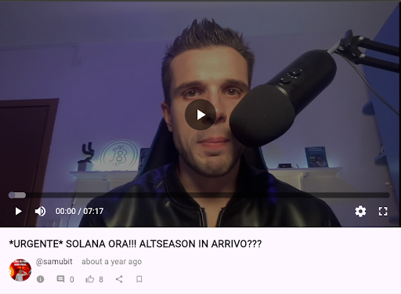

# Video Player Screen Component



A Flutter video player component designed for the Hive/3Speak platform that provides adaptive layouts for mobile and desktop/web platforms with integrated user interaction features.

## Overview

The `VideoPlayerScreen` is a stateful widget that combines video playback capabilities with social features like voting, user authentication, and post information display. It automatically adapts its layout based on screen size and handles IPFS video URL resolution.

## Dependencies

```yaml
dependencies:
  flutter/material.dart
  video_player: ^2.x.x
  chewie: ^1.x.x
  flutter_secure_storage: ^9.x.x
  http: ^1.x.x
  hive_flutter_kit: # Custom package
```

## Constructor Parameters

| Parameter | Type | Required | Description |
|-----------|------|----------|-------------|
| `videoUrl` | `String` | ✅ | URL of the video to play (supports IPFS URLs) |
| `title` | `String` | ✅ | Title of the video |
| `author` | `String` | ✅ | Username of the video author |
| `permlink` | `String` | ✅ | Unique identifier for the post |
| `createdAt` | `DateTime?` | ❌ | Creation timestamp of the video |
| `item` | `GQLFeedItem` | ✅ | Complete feed item data |

## Usage Example

```dart
Navigator.push(
  context,
  MaterialPageRoute(
    builder: (context) => VideoPlayerScreen(
      videoUrl: videoUrl ?? '',
      title: item.title ?? 'Untitled',
      author: item.author?.username ?? 'Unknown',
      permlink: item.permlink ?? 'Unknown',
      createdAt: item.createdAt,
      item: item,
      // ✅ Optional Callbacks
      isUserVoted: () {},
      onTapComment: () {},
      onComment: (body) {},
      onUpvoteComment: () {},
      onReplyComment: () {},
      onShare: () {},
      onBookmark: () {},
      onTapAuthor: () {},
    ),
  ),
);
```
## Features

### 🎥 Video Playback
- Supports HLS streaming with adaptive bitrate
- IPFS URL resolution with platform-specific optimization
- Auto-play functionality with full-screen support
- Aspect ratio maintained at 16:9

### 📱 Responsive Layout
- **Mobile Layout**: Stacked video player and info panel
- **Desktop/Web Layout**: Centered video player with wider container (1600px max width)
- Automatic layout switching at 800px breakpoint

### 🔐 User Authentication
- Secure storage integration for user credentials
- Login state management
- User-specific features (voting, favorites)

### 🗳️ Social Features
- Hive blockchain integration for post information
- User voting status tracking
- Real-time post data loading
- User favorites management

### Resolution Strategy
- **Web**: Uses manifest.m3u8 for adaptive streaming
- **Android**: Uses 480p/index.m3u8 for optimized mobile playback
- **Other platforms**: Defaults to manifest.m3u8

## Integration Requirements

### Required Models
- `LoginModel`: User authentication data
- `GQLFeedItem`: Feed item structure
- `HivePostInfoPostResultBody`: Hive post information
- `UserFavoriteProvider`: User favorites management

### Required Widgets
- `VideoInfo`: Displays video metadata and user interactions

### Secure Storage
Uses `FlutterSecureStorage` for:
- Username storage (`'username'` key)
- Authentication token storage (`'token'` key)
